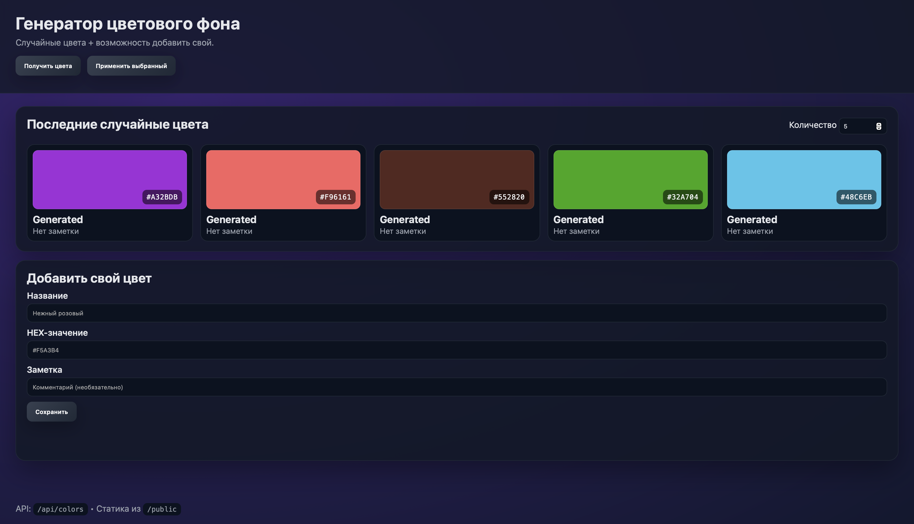

# Генератор цветового фона (Express.js)

Небольшое Express-приложение с API и статическим интерфейсом. Позволяет генерировать случайные цвета, применять их как фон страницы и сохранять свои варианты. 



## Возможности
- Базовый Express-сервер с раздачей статики из `public/`.
- Маршруты API (`GET/POST/PUT/DELETE`) с параметрами, query и телом запроса.
- Обработка JSON и urlencoded тел (`express.json`, `express.urlencoded`).
- Собственный middleware логирования запросов.
- Логика разделена на контроллеры и маршруты.
- Простая фронтенд-страница, работающая через fetch с API.

## Быстрый старт
```bash
cd /Users/mnwa/Documents/generator_color_screen/my-express-app
npm install
npm run start
# Открыть http://localhost:3000
```

Для разработки можно включить автоперезапуск:
```bash
npm run dev
```

## Структура проекта
- `server.js` — точка входа, подключает middleware, статику и маршруты.
- `src/routes/colorRoutes.js` — роутер для `/api/colors`.
- `src/controllers/colorsController.js` — обработчики API.
- `src/middleware/requestLogger.js` — пользовательский middleware.
- `src/data/colorsStore.js` — простое in-memory хранилище и генерация случайных цветов.
- `public/` — статические файлы (HTML, CSS, JS, скриншоты).

## API кратко
- `GET /api/health` — проверка статуса.
- `GET /api/colors` — список сохранённых цветов, `?search=` для фильтра.
- `GET /api/colors/random?count=5` — пакет случайных цветов (до 30).
- `GET /api/colors/:id` — получить цвет по id.
- `POST /api/colors` — создать цвет, тело: `{ name, value, note? }` (HEX).
- `PUT /api/colors/:id` — обновить цвет.
- `DELETE /api/colors/:id` — удалить.

## Пример использования через curl
```bash
curl -X POST http://localhost:3000/api/colors \
  -H "Content-Type: application/json" \
  -d '{"name":"My Pink","value":"#F5A3B4","note":"custom"}'
```
